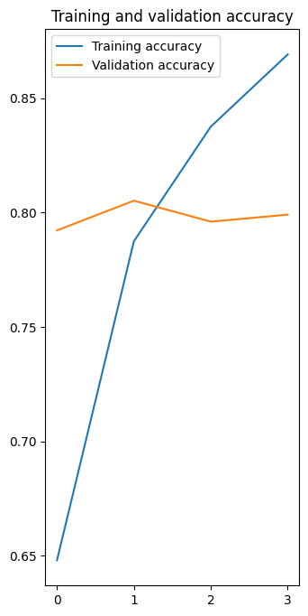
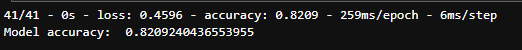
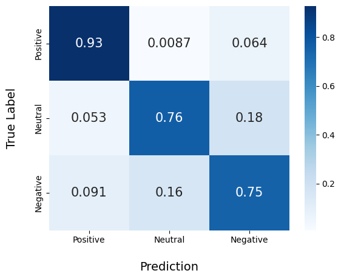

# Machine Learning - README.md

This repository contains a Machine Learning FastAPI project that implements sentiment analysis and rating prediction based on user input. The project provides an API with two endpoints: `/predict_review` for sentiment analysis and `/new_ratings` for predicting new ratings based on sentiment analysis results.

## Model Documentation 📄

Tensorflow model with NNLM-ID-128 is a tensorflow model that has been built by leveraging pre-trained word embeddings from the NNLM-ID-128 model. This approach allows the model to benefit from the knowledge and representations learned from a large corpus of text data. The additional layers and pruning techniques have been applied to further refine and optimize the model's performance. The output layer uses softmax activation to produce probability distributions over the target classes. The model has been trained using the Adam optimizer.

### Training Validation Accuracy and Loss 🎯

<div style="height:300px; text-align:center">
  
  
</div>
The training and validation accuracy and loss metrics provide insights into the performance of the model during the training process.

### Test Accuracy 🎯

<div style="height:auto; text-align:center">
  
</div>

The test accuracy reflects the performance of the model on an independent test dataset. This dataset is kept separate from both the training and validation datasets and serves as a final evaluation of the model's performance. The test accuracy provides an unbiased estimate of how well the model can perform on new, unseen data.

### Confusion Matrix 🤔

The confusion matrix is a visualization that shows the performance of a classification model across different classes or categories. It provides insights into the model's ability to correctly predict each class and identify potential areas of confusion. The matrix displays the true positive (TP), true negative (TN), false positive (FP), and false negative (FN) values for each class.

<div style="height:200px; text-align:center">
  
</div>

## Prerequisites📝

Before running the project, make sure you have the following:

- Python 3.x installed 🐍
- Required dependencies installed. You can install them by running the following command:
  ```
  pip install -r requirements.txt
  ```
- `nlp_model.h5` file or download via [this link](https://drive.google.com/drive/folders/1uMxvLDZasS30YuTvc7Ng2sGkp7mbeO3O?usp=sharing)

## Usage ⚙️

To start the server and use the API, follow these steps:

1. Ensure all the prerequisites are met.✅
2. Open a terminal or command prompt in the project directory.
3. Run the following command to start the server:
   ```
   python main.py
   ```
   The server will start running at `http://localhost:8080`.

## API Endpoints 🔗

### Health Check Endpoint 🚑

- **Endpoint:** `/`
- **Method:** GET
- **Description:** A test endpoint to check if the server is running.
- **Response:** Returns a simple "Hello world from ML endpoint!" message.

### Sentiment Analysis Endpoint 🔮

- **Endpoint:** `/predict_review`
- **Method:** POST
- **Description:** Predicts sentiment analysis based on the given text.
- **Request Body:**
  - `text` (str): The text to analyze.
- **Response:** Returns the predicted sentiment as a string. Possible values are "Positive", "Neutral", or "Negative". If an error occurs during prediction, it returns an "Internal Server Error" message.

### Rating Prediction Endpoint ✨

- **Endpoint:** `/new_ratings`
- **Method:** POST
- **Description:** Predicts new ratings for a user based on a list of user ratings and a sentiment analysis result.
- **Request Body:**
  - `predicted` (str): The sentiment analysis result (e.g., "Positive", "Neutral", "Negative").
  - `user_rating` (list): A list of user ratings.
- **Response:**
  - `total_rating` (float): The updated overall rating.
  - `new_ratings` (list): The list of user ratings with the new rating appended.
- **Response Model:** `ResponseRating`
- **Response Model Fields:**
  - `total_rating` (float): The updated overall rating.
  - `new_ratings` (list): The list of user ratings with the new rating appended.

## Additional Notes 📜

- If this is your first time running the project, make sure to install the required dependencies by running `pip install -r requirements.txt`.
- You can access the API documentation easily by visiting `http://localhost:8080/docs` in your browser after starting the server.
- The model used for sentiment analysis can be either an h5 model (`nlp_model.h5`) or a saved model (`my_model_folder`). Make sure to uncomment the appropriate line in `main.py` based on the model type you are using.

## Contributing ✍️

Contributions are welcome! If you find any issues or want to add new features, feel free to open an issue or submit a pull request.

## License

This project is licensed under the [MIT License](LICENSE).

## Author 👤

- [Alif](https://github.com/muhammadalifalfarizi)
- [Dafa](https://github.com/daptheHuman)
- [Anin](https://github.com/peachaen)
